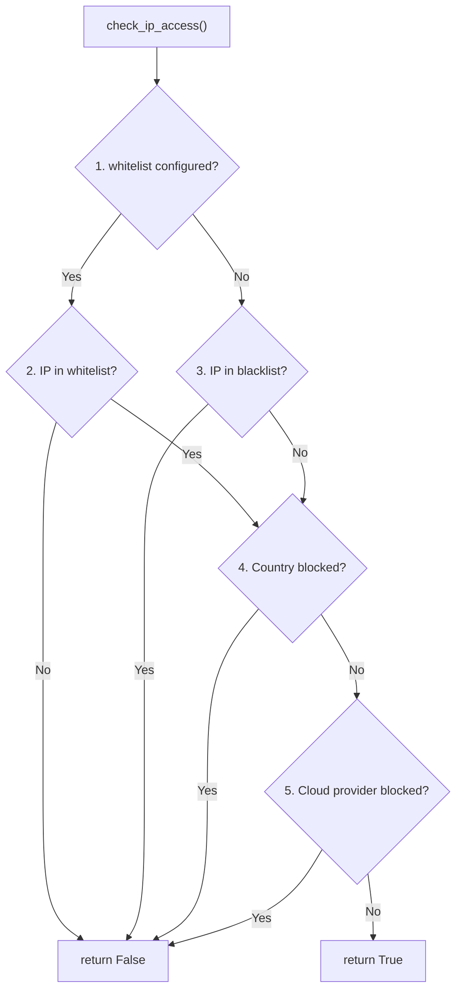

---

title: IP Management
description: IPBanManager internals, IP allow/block logic, CIDR support, and country-based filtering in guard-core
keywords: ip banning, ip management, blacklist, whitelist, cidr, guard-core
---

IP Management
=============

Guard-core provides layered IP access control through the `IPBanManager` handler and utility functions in `guard_core.utils`. This page covers the internal mechanics that adapter developers need to understand.

IPBanManager
------------

`IPBanManager` is a singleton that manages a set of banned IPs using a dual-layer storage strategy: a local `TTLCache` for fast lookups, and optional Redis for distributed state.

### Singleton Pattern

```python
class IPBanManager:
    _instance = None

    def __new__(cls) -> "IPBanManager":
        if cls._instance is None:
            cls._instance = super().__new__(cls)
            cls._instance.banned_ips = TTLCache(maxsize=10000, ttl=3600)
            cls._instance.redis_handler = None
            cls._instance.agent_handler = None
        return cls._instance
```

The singleton is pre-instantiated as `ip_ban_manager` at module level.

### Storage

| Layer      | Backend                          | TTL        | Capacity |
|------------|----------------------------------|------------|----------|
| Local      | `cachetools.TTLCache`            | 3600s      | 10,000   |
| Distributed| Redis (via `RedisManager`)       | Per-ban    | Unlimited|

### Key Methods

**`ban_ip(ip, duration, reason="threshold_exceeded")`**

Stores `(ip, expiry_timestamp)` in both local cache and Redis. Also fires a ban event to the agent handler if configured. When `ip` contains `"/"` it is treated as a CIDR network and routed to a separate `banned_networks` list/Redis namespace instead (no agent ban event in that branch). `duration` cannot exceed `LOCAL_CACHE_TTL_CAP_SECONDS` (3600s) when Redis is unavailable, since the local `TTLCache` cannot hold a ban longer than its own TTL; exceeding it raises `ValueError`.

**`unban_ip(ip)`**

Removes the IP from both local cache and Redis.

**`is_ip_banned(ip) -> bool`**

Lookup order:

1. Check local `TTLCache`. If present and not expired, return `True`. If expired, remove and continue.
2. Check Redis. If present and not expired, promote to local cache and return `True`. If expired, delete from Redis.
3. Return `False`.

**`reset()`**

Clears both the local cache and all `{redis_prefix}banned_ips:*` keys from Redis.

### Initialization

```python
await ip_ban_manager.initialize_redis(redis_handler)
await ip_ban_manager.initialize_agent(agent_handler)
```

Both are optional. Without Redis, bans are local to the process. Without an agent handler, ban/unban events are not sent.

___

IP Allow/Block Logic
--------------------

The function `check_ip_access()` in `guard_core.utils` implements the global IP evaluation chain; `IpSecurityCheck._check_global_ip_restrictions` calls it directly. `is_ip_allowed()` is a thin bool-returning wrapper around `check_ip_access()` (same `skip_ip_lists`/`skip_countries` signature) kept for external callers that only need a yes/no answer, not `check_ip_access()`'s richer `IpAccessResult` (which also names the cloud provider and network on a cloud-provider block); it is not called anywhere else inside `guard_core`. `IpSecurityCheck` calls `check_ip_access()` for every request that reaches this step (after any route-level check has run and not blocked), passing `skip_ip_lists` / `skip_countries` flags that suppress the IP-list or country gate independently: `skip_ip_lists` is `True` whenever the route declares a non-empty `ip_whitelist` (a non-matching IP would already have been denied by the route-level step above, so reaching here means it matched); `skip_countries` is `True` only when the route's `whitelist_countries` actually matches the resolved country for this request. A route `ip_whitelist` match does not, by itself, suppress country enforcement.

### Evaluation Order



When `config.whitelist` is configured, it alone governs the IP-list gate — a whitelist match is allowed even if the same IP also falls inside `config.blacklist` (explicit allow overrides deny, since v3.2.0). The blacklist is only consulted when no whitelist is configured.

### Blacklist Check

```python
async def _check_blacklist(ip_addr, ip, config) -> bool:
    for blocked in config.blacklist:
        if "/" in blocked:
            if ip_addr in ip_network(blocked, strict=False):
                return False  # blocked
        elif ip == blocked:
            return False  # blocked
    return True  # not blocked
```

Supports both individual IPs and CIDR ranges (e.g., `10.0.0.0/8`).

### Whitelist Check

```python
async def _check_whitelist(ip_addr, ip, config) -> bool:
    if config.whitelist:
        for allowed in config.whitelist:
            if "/" in allowed:
                if ip_addr in ip_network(allowed, strict=False):
                    return True
            elif ip == allowed:
                return True
        return False  # whitelist exists but IP not in it
    return True  # no whitelist, all allowed
```

!!! info "Whitelist Semantics"
    When `config.whitelist` is `None`, the whitelist is disabled and all IPs pass. When it is an empty list `[]`, no IPs pass. This distinction matters for adapter developers exposing configuration.

### Country Check

Uses the `GeoIPHandler` protocol to resolve the country code for an IP, then checks it against `config.blocked_countries` and `config.whitelist_countries`. If the country cannot be resolved (reader uninitialized, lookup failure, or unrecognized IP), `check_ip_country` returns `False` — not blocked — the same as when no country rules are configured; this is deliberate fail-open behaviour and is covered by a dedicated regression test.

### Cloud Provider Check

Delegates to `CloudManager.is_cloud_ip()` to check if the IP belongs to a blocked cloud provider. Before the provider's ranges are populated, `is_cloud_ip()` fails open the same way — `False`, not blocked — and logs a rate-limited `WARNING` so the window is visible instead of silent; see [Provider Status](../configuration/security-config.md#provider-status).

### Provider Status

The `IPInfoManager` instance's `get_status()` reports the same three fields as [`cloud_handler.get_status()`](cloud-providers.md#provider-status) — `ready`, `last_refreshed`, `entries` — so a caller polling both subsystems gets a uniform shape:

```python
def get_status(self) -> dict[str, Any]:
    return {
        "ready": self.is_initialized,
        "last_refreshed": self.last_refreshed,
        "entries": self.entry_count,
    }
```

`entries` is `reader.metadata().node_count` — a cheap, already-in-memory count of nodes in the loaded MMDB search tree — and `0` while `reader` is `None`. `last_refreshed` is set on every successful `initialize()`/`refresh()` and stays at its last value if a later refresh fails, so `ready=False` with a non-`None` `last_refreshed` means "this used to work." Your adapter's status surface combines this with `cloud_handler.get_status()` into one payload (fastapi-guard: `SecurityMiddleware.get_initialization_status()` or `GET /_guard/status`) — see [Provider Status](../configuration/security-config.md#provider-status).

___

Client IP Extraction
--------------------

```python
async def extract_client_ip(
    request: GuardRequest,
    config: SecurityConfig,
    agent_handler: AgentHandlerProtocol | None = None,
) -> str
```

When no client address can be resolved, `extract_client_ip` returns the sentinel `UNKNOWN_CLIENT_IDENTITY` (value `"unknown"`), exported from `guard_core.utils` and mirrored at `guard_core.sync.utils`. Every `"unknown"` reference below is that same sentinel; compare against the constant rather than the literal string.

### Logic

1. If `request.client_host` is `None`: return the address resolved from `X-Forwarded-For` when `"unix"` is in `trusted_proxies` (same depth logic as step 6 below, falling back to `"unknown"` if the header is absent or the chain is too short); otherwise return `"unknown"`. The adapter's passthrough step (see [Middleware Integration](../adapters/middleware-integration.md)) only reaches this resolution for a non-excluded path -- an excluded path (a health or readiness endpoint, for example) passes through unaffected, before identity is resolved at all. For a non-excluded path, the passthrough step rejects the request with 403 before this point when the resolved identity is `"unknown"` and `fail_secure=True` (the default); with `fail_secure=False` the pipeline still runs with that identity, and `check_ip_access` treats `"unknown"` as no address available: the request is allowed unless a whitelist or a country allow-list is configured (`whitelist` or `whitelist_countries`; membership cannot be proven for an address that does not exist, so it is blocked), and the blacklist, `blocked_countries`, and cloud-provider checks are skipped since none of them can match without an address. A decorated route follows the same rule: `check_route_ip_access` blocks only when the route's own `ip_whitelist` or `whitelist_countries` is set, and otherwise passes the identity through to the global check untouched, since a route `ip_blacklist` or `blocked_countries` rule cannot match it either. Detection and the shared `"unknown"` rate-limit bucket still apply.
2. Get the connecting IP from `request.client_host`.
3. Get `X-Forwarded-For` header value.
4. If no trusted proxies are configured, log a spoofing warning (if `X-Forwarded-For` is present) and return the connecting IP.
5. If the connecting IP is not a trusted proxy, log a spoofing warning and return the connecting IP.
6. If the connecting IP is a trusted proxy, extract the client IP from `X-Forwarded-For` counting from the right end of the comma-separated list (`ips[-trusted_proxy_depth]`); with the default depth of `1` that is the rightmost entry, not the leftmost, since each proxy hop appends its own view to the right.

### Trusted Proxy Evaluation

```python
def _is_trusted_proxy(connecting_ip, trusted_proxies) -> bool:
    for proxy in trusted_proxies:
        if "/" in proxy:
            if ip_address(connecting_ip) in ip_network(proxy, strict=False):
                return True
        elif connecting_ip == proxy:
            return True
    return False
```

### Spoofing Detection

When an `X-Forwarded-For` header is received from an untrusted source, guard-core logs a warning and fires an agent event with `event_type="suspicious_request"` and `action_taken="spoofing_detected"`. The request is still processed using the connecting IP.

### Unsatisfiable and Over-Counted Depth

`trusted_proxy_depth` is a contract: it names how many proxy hops you vouch for, and the peer that connects to guard-core must itself be in `trusted_proxies`. Two misconfigurations are now surfaced with a one-time (per process) `WARNING`, not silently absorbed:

- **Chain shorter than `trusted_proxy_depth`.** If `X-Forwarded-For` has fewer comma-separated entries than `trusted_proxy_depth`, guard-core cannot index the entry it was told to trust and falls back to the connecting peer, exactly as before -- but now logs the configured depth, the observed chain length, and the fallback once.
- **The depth-selected entry is itself a trusted proxy.** If the address `trusted_proxy_depth` selects from the chain is itself listed in `trusted_proxies`, the chain likely has more real proxy hops than `trusted_proxy_depth` accounts for (an over-count signal): guard-core is probably still resolving a proxy's own address, not the client's. Identity resolution is unchanged in both cases; only the warning is new.

Repeated `X-Forwarded-For` field lines are joined by the adapter before guard-core sees them (guard-core reads the header as a single string); an ASGI adapter that only returns the first field line's value for a duplicate header name is an adapter-layer defect, not something this function can detect or correct.

### Deployment Prerequisite: Disable the App Server's Own Forwarded-Header Handling

`request.client_host` is whatever the ASGI/WSGI server puts in `scope["client"]` (or its WSGI equivalent) by the time it reaches the adapter — guard-core never sees the raw TCP peer. Several app servers rewrite that value themselves from `X-Forwarded-For` before any application code, including guard-core, runs. uvicorn is the clearest example: `proxy_headers=True` and `forwarded_allow_ips="127.0.0.1"` are its defaults, so a reverse proxy connecting from loopback (the common case for a same-host `proxy_pass`) has its `X-Forwarded-For` applied to `scope["client"]` upstream of guard-core. Gunicorn, Hypercorn, and other WSGI/ASGI servers have equivalent forwarded-header options; the same reasoning applies to whichever one is in front of your app.

When that happens, `connecting_ip` in `extract_client_ip` is no longer the connecting peer — it is already the value the header carried. Two things follow:

- With `trusted_proxies` unset, the function returns `connecting_ip` immediately (step 4 above) believing no proxy is declared, so the header is "never trusted" — but the server already trusted it. Every value an attacker puts in `X-Forwarded-For` becomes the "connecting" IP as far as guard-core, rate limiting, and IP bans are concerned.
- With `trusted_proxies` configured but not matching this pre-resolved peer, the untrusted-peer branch fires — logging spoofing warnings and `spoofing_detected` agent events on ordinary traffic, because the peer now equals the forwarded value it supposedly "spoofed".

guard-core detects the fingerprint of this condition — the connecting IP appearing among the entries of its own `X-Forwarded-For` chain, which a real proxy never produces for the address it received the connection from — and logs one warning (not per-request) naming the fix. It cannot recover the true peer once the server has already overwritten it; this is observability only, not a repair.

**Fix**: turn off the server's own forwarded-header handling and let guard-core be the single authority via `trusted_proxies` / `trusted_proxy_depth`:

- uvicorn: pass `--no-proxy-headers` on the CLI, or `proxy_headers=False` to `uvicorn.run(...)`.
- Gunicorn, Hypercorn, and other WSGI/ASGI servers: disable their equivalent forwarded-header/proxy-trust setting the same way.

With the server's own handling off, its access log will show the proxy's address rather than the original client — that is expected, since `X-Forwarded-For` is no longer applied before the request reaches your application.

___

Route-Level IP Access
---------------------

The `check_route_ip_access()` helper in `guard_core.core.checks.helpers` evaluates IP access for decorator-configured routes:

```python
async def check_route_ip_access(client_ip, route_config, middleware) -> bool | None:
```

**Returns**:

- `False` -- the route denies the request: an `ip_blacklist` match (only consulted when `ip_whitelist` did not itself match), a configured `ip_whitelist` the IP failed to match, a `blocked_countries` match, or a `whitelist_countries` miss.
- `True` -- an `ip_whitelist` match, or (independently) a `whitelist_countries` match.
- `None` -- neither the IP aspect nor the country aspect produced a decision; fall through to global rules.

**Evaluation** — the IP aspect and the country aspect are computed independently and then combined: either aspect returning `False` denies the request; otherwise either aspect returning `True` allows it.

1. `RouteConfig.ip_whitelist` is checked first: a match allows, a non-empty list with no match denies, an empty/unset list defers (`None`).
2. `RouteConfig.ip_blacklist` is only checked when the whitelist deferred: a match denies. A route `ip_whitelist` match therefore wins over that same route's `ip_blacklist` (v3.2.0 precedence, unchanged).
3. Country access is computed independently via `RouteConfig.blocked_countries` and `RouteConfig.whitelist_countries` using `GeoIPHandler` — an `ip_whitelist` match does **not** skip this step.
